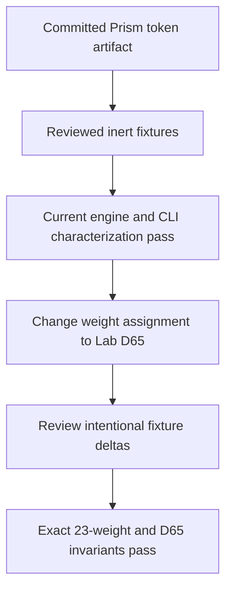
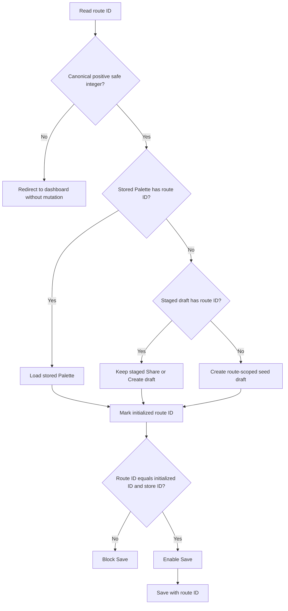

# Palette Correctness Invariants - Plan

## Goal Capsule

- **Objective:** Tonal Foundry users can trust exported token groups, displayed color evidence, Palette identity, and every generated 23-weight Scale.
- **Means:** Ship the five selected fixes together. Establish reviewed characterization evidence before changing D65 behavior. Apply the safety and identity invariants at their owning boundaries. See KTD1-KTD6.
- **Authority:** Session-settled decisions and Product Requirements override planning assumptions. Repository instructions and current public contracts override local implementation convenience.
- **Execution profile:** Code change on one review branch. Use characterization-first sequencing for engine work. Add no dependency.
- **Stop conditions:** Do not ship if a test computes its expected result through the production path, a dynamic token key reaches an inherited object, Save can run with mismatched identities, or a Scale does not return the exact ordered weight contract.
- **Tail ownership:** The implementer owns source changes, tests, local gates, browser evidence, and a review-ready PR. Required CI remains the merge gate.

---

## Product Contract

### Summary

This plan hardens five existing Tonal Foundry contracts without adding product scope. It makes DTCG export safe for arbitrary accepted names, freezes representative engine output, reports the metric for the rendered foreground, keeps editor and route identity equal, and applies CIE Lab D65 throughout weight placement.

### Problem Frame

Several current checks can report success while user-visible data is wrong. The CLI test computes its expectation with the generator under test. DTCG Scale names can resolve inherited object properties. WCAG can report the white ratio beside dark text, and CAM16 J is labeled as L\*. A transient shared Palette can be replaced by Palette 1 during Edit and then overwrite it. Scale candidates are selected with D65 lightness but assigned weights with D50 lightness, which can duplicate one weight and omit another.

### Requirements

**Export safety**

- R1. `buildDtcgTokens` must treat accepted Palette and Scale names as inert own keys at every dynamic dictionary level, including `__proto__`, `constructor`, and `prototype`, without changing ambient prototypes or ordinary JSON shape.

**Characterization and Scale generation**

- R2. Engine and CLI expectations must come from reviewed inert literals that do not call the production generator, Color.js, or production constants to derive expected values at test runtime.
- R3. Scale target selection, authored-Key placement, generated-Swatch weight assignment, stored CIE L\* values, and weight helper names must use CIE Lab D65. Every returned Scale must contain the exact ordered 23 weights once each with matching indexes.

**Swatch evidence and Palette lifecycle**

- R4. Dashboard and editor must use one presentation rule that renders exact white or black, displays the WCAG ratio for that foreground, and labels CAM16 lightness as J.
- R5. A valid editor route, initialized editor-store draft, and saved Palette must share one ID. After dashboard persistence hydration, Share, Create, existing Edit, and valid unknown-ID fallbacks must preserve their data through Edit, and Save must not write another Palette.

**Quality gate**

- R6. The completed branch must pass the full test suite, lint without new warnings, strict typecheck, production build, and the defined browser identity checks.

### Acceptance Examples

- AE1. Covers R1. Given Palette name `constructor` and Scale name `__proto__`, DTCG export serializes both as own groups and leaves `Object.prototype` and `Object` unchanged.
- AE2. Covers R4. Given a white Swatch with WCAG selected, the preview renders `#000000` and displays `wcag_black`; a black Swatch renders `#ffffff` and displays `wcag_white`.
- AE3. Covers R5. Given a Share link whose local generated ID is 2, Edit and Save preserve its name, Scale order, Keys, Output Space, and ID 2 while Palette 1 remains unchanged.
- AE4. Covers R3. Given Key `#3366ff`, its D65 L\* places the anchor at weight `500`, and the returned Scale weights match the literal sequence from `000` through `999`.
- AE5. Covers R5. Given a non-canonical or unsafe route ID, the editor does not initialize or save a Palette and returns the user to the dashboard without reading storage.

### Scope Boundaries

In scope are the five selected findings and their direct regression tests. The branch may extract small pure helpers when they make the invariant testable in the existing Node test environment.

#### Deferred to Follow-Up Work

- Full persisted/share-payload schema validation and a browser automation harness.
- Dashboard Create/Edit allocation before persistence hydration. This is a separate stale-list race; route initialization and the Save guard still close the selected wrong-ID write path.
- Making every non-persistence editor control inert during route transitions. This plan guards initialization and Save; a later UI lifecycle pass can disable transient name, Output Space, Scale, Key, Share, Export, Delete, and open-confirmation actions as one coherent change.
- DTCG missing-hue conformance, duplicate Scale names, and broader export-contract work.
- Source-gamut provenance, authored-Key collision policy, and engine performance caching.
- Broader Palette preview component consolidation.

Out of scope are backend persistence, compatibility flags, white-point configuration, target-array changes, interpolation changes, dependency additions, and unrelated lint cleanup.

---

## Planning Contract

### Key Technical Decisions

- KTD1. **Ship all five fixes on one review branch.** (session-settled: user-approved — chosen over leaving any selected finding in the backlog: the user approved the complete default recommendation.) Governs R1-R6.
- KTD2. **Land reviewed characterization evidence before D65 behavior changes.** (session-settled: user-approved — chosen over production-generated expected values: the current coupled tests cannot detect shared numerical drift.) The committed Prism token rows are the approved prior regression artifact. Governs R2-R3.
- KTD3. **Use null-prototype records plus own-property checks for dynamic DTCG groups.** This accepts inherited-property names as data instead of creating a name blacklist. Governs R1.
- KTD4. **Resolve Swatch foreground and label together in one pure presentation helper.** (session-settled: user-approved — chosen over white-only WCAG and an L\* CAM16 label: both routes currently display false evidence.) Governs R4.
- KTD5. **Separate dashboard staging from route initialization, then key Save readiness to the route ID.** (session-settled: user-approved — chosen over a seed fallback with another ID: the mismatch can overwrite Palette 1.) Dashboard handoff clears readiness; only the editor may atomically initialize a resolved same-ID Palette. Remove URL and storage reads from store module initialization. Governs R5.
- KTD6. **Use Color.js `lab_d65.l` for weight placement and explicit D65-lightness helper names.** (session-settled: user-approved — chosen over mixed D65 targeting and D50 assignment: the mixed white point duplicates and omits weights.) Do not add aliases for the obsolete luminance names. Governs R3.

### Assumptions

These are unconfirmed planning defaults for the non-interactive run:

- A route ID is valid only when the complete string is a canonical positive decimal integer and its numeric value is safe. Invalid IDs redirect to `/dashboard` without changing the editor store or localStorage.
- A valid unknown ID creates a fresh route-scoped copy of the seed content with that ID and the name `Palette <id>`. It remains unsaved until Save.
- The WCAG presentation chooses the larger stored white or black ratio. A tie chooses black. The rendered values are exact `#ffffff` and `#000000`, which match the engine metrics.
- `app/globals.css` supplies the approved primary and secondary OKLCH regression values. Tests transcribe those values into literals and do not parse CSS or generate expectations during the test run.
- The existing global Zustand store remains because Share and Create need a client-navigation draft handoff. A new provider or store instance would add structure without improving this single-editor flow.

### High-Level Technical Design

The engine change uses a proof checkpoint before the intentional behavior change.

Editor initialization is keyed to the route ID. Save becomes available only after the route, initialized state, and store agree.

### Sequencing

U1 must complete and pass against current behavior before U5 starts. U2, U3, and U4 are independent after U1 and may be implemented in any order. Run the full repository and browser gates after all units are integrated.

### System-Wide Impact

- **Users:** Contrast evidence changes visibly. Shared and unknown-ID drafts keep their own identity. D65 can change weight labels for chromatic Keys.
- **Engine consumers:** Browser previews, CLI output, DTCG export, Tailwind export, and JSON export all consume the corrected Scale weights.
- **Developers:** Literal fixtures become the review boundary for intentional numerical changes. No new runtime or test dependency is introduced.
- **Persistence:** Existing saved records need no migration. Only future Save operations use the route-safe identity rule.

### Risks and Dependencies

- A fixture can freeze a defect as if it were truth. Mitigation: source baseline values from the committed token artifact, label them regression evidence, and review only the D65 delta in U5.
- Client navigation can expose a stale identity frame. Mitigation: staging clears Save readiness, only same-ID route resolution atomically restores it, and Save repeats the route/store/initialized equality guard before persistence. The separate pre-hydration dashboard race and transient non-persistence controls remain explicit residuals.
- Null-prototype objects differ from ordinary objects for inherited methods. Mitigation: use static `Object` APIs and verify JSON serialization plus ordinary-name parity.
- D65 weight correction is behavior-changing. Mitigation: retain target arrays, interpolation, gamut mapping, and output spaces, then assert the exact public weight sequence and representative color values.
- The implementation depends on existing Color.js 0.5.2 semantics: `lab` is D50 and `lab_d65` is D65.

### Sources and Research

- Existing approved output: `app/globals.css` Prism primary and secondary token rows.
- [Color.js color spaces](https://colorjs.io/docs/spaces.html) and [chromatic adaptation](https://colorjs.io/docs/adaptation) define the D50/D65 distinction used by KTD6.
- [Next.js `useParams`](https://nextjs.org/docs/app/api-reference/functions/use-params) confirms App Router params are runtime strings.
- [Zustand with Next.js](https://zustand.docs.pmnd.rs/guides/nextjs) confirms global stores persist across SPA navigation and must be initialized for route state.
- [MDN prototype pollution defenses](https://developer.mozilla.org/en-US/docs/Web/Security/Attacks/Prototype_pollution) and [Object.hasOwn](https://developer.mozilla.org/en-US/docs/Web/JavaScript/Reference/Global_Objects/Object/hasOwn) support KTD3.
- [Vitest snapshots](https://vitest.dev/guide/snapshot) distinguishes reviewed regression baselines from independent correctness oracles.

---

## Implementation Units

### U1. Establish reviewed engine characterization

- **Goal:** Replace self-derived engine and CLI expectations with inert regression fixtures before any production engine change.
- **Requirements:** R2; supports R3 and KTD2.
- **Dependencies:** None.
- **Files:**
  - Create `src/engine/__tests__/fixtures/scale-goldens.ts`.
  - Modify `src/engine/__tests__/cli-scale.test.ts`.
  - Modify `src/engine/__tests__/scale.test.ts`.
  - Modify `src/engine/__tests__/palette.test.ts` only when the full-Palette contract adds non-duplicated value.
  - Read `app/globals.css` as the approved source artifact; do not modify it.
- **Approach:**
  1. Define fixture authority field by field: Keys come from the committed `seedPalette`; semantic, tween, and destination-space values come from explicit API or CLI inputs; the full 23-weight sequence and representative primary and secondary OKLCH destinations come from `app/globals.css`. Treat captured values without an independent artifact as characterization evidence, not a correctness oracle.
  2. Record the current `#3366ff` anchor placement as `550` with independently stated D50 and D65 expectations. Add a named CSS `blue` characterization whose pre-fix weights duplicate `700` and omit `650`, so U5 has a focused red regression.
  3. Remove `buildExpected` and the `buildScale` import used to create CLI expectations.
  4. Compare public `buildScale` and CLI output projections with the inert fixture. Keep `hex`, gamut flags, and fields not supported by the approved artifact structural unless a reviewed literal is recorded with its characterization provenance.
  5. Verify the fixture and CLI test contain no production expectation imports or calls before changing engine code.
- **Execution note:** Land and run this characterization unit against current production behavior before U5. Treat the resulting diff as a separate review checkpoint.
- **Patterns to follow:** Keep Vitest `describe`/`it`/`expect` style and Node environment from `src/engine/__tests__/scale.test.ts`. Keep fixture modules outside the `*.test.ts` glob.
- **Test scenarios:**
  - A single-Key primary case returns the approved locked endpoints, authored anchor, representative generated neighbors, and literal OKLCH destinations.
  - A multi-Key secondary case preserves authored Key positions and representative approved destinations.
  - The CLI invoked with the fixture's exact Keys, semantic name, and OKLCH output matches the literal semantic, spaces, weights, and destinations without calling `buildScale` in the test process.
  - Floating metrics use explicit `toBeCloseTo` precision against literals rather than snapshots of Color.js objects.
  - A source scan of both `scale-goldens.ts` and `cli-scale.test.ts` finds no `buildScale`, `buildPalette`, `toColor`, `Color`, or imported `weights` expectation generator.
- **Verification:** Current production behavior passes the new focused tests before U5 changes any production file in `src/engine/`.

### U2. Isolate dynamic DTCG groups

- **Goal:** Make inherited-property names safe at every DTCG dictionary level without restricting accepted names.
- **Requirements:** R1 and AE1; follows KTD3.
- **Dependencies:** None.
- **Files:**
  - Modify `src/lib/share.ts`.
  - Create `src/lib/share.test.ts`.
  - Modify `vitest.config.ts` to resolve the repository's existing `@/` runtime imports in Node tests; add no plugin or package.
- **Approach:**
  1. Create the Palette, Scale, and weight dictionaries with null prototypes.
  2. Use own-property checks when a Scale group may already exist.
  3. Keep `DtcgTokens`, ordinary JSON output, and name acceptance unchanged.
  4. Add an explicit Vitest `@` alias to the repository root because `share.ts` has runtime alias imports and the current Node test config defines no resolver.
  5. Run each adversarial Scale name separately. Before the red test, capture complete own-property descriptors for `Object`, `Object.prototype`, and every inherited callable the case can touch; restore them in `finally` before assertions so a pre-fix failure cannot contaminate later tests.
- **Patterns to follow:** Keep export construction in `src/lib/share.ts`. Use static `Object` operations because null-prototype records do not inherit object methods.
- **Test scenarios:**
  - `__proto__`, `constructor`, `prototype`, `toString`, and `hasOwnProperty` each work as a Palette name and as a Scale name.
  - `tokens.color`, the Palette group, and every Scale group each expose dynamic names as own enumerable keys and have a null prototype.
  - JSON serialization preserves all adversarial groups and their Swatches.
  - `Object.prototype`, `Object`, and inherited callable values retain their exact captured own-property descriptors after export, including all 23 possible weight keys.
  - Ordinary Palette and Scale names serialize to the same JSON shape as before.
  - Multiple ordinary Scales remain distinct.
- **Verification:** The focused regression fails safely before the fix, passes after it, and leaves no ambient mutation even when an assertion fails.

### U3. Pair rendered foreground with displayed metric

- **Goal:** Make dashboard and editor render and label one shared Swatch presentation result.
- **Requirements:** R4 and AE2; follows KTD4.
- **Dependencies:** None.
- **Files:**
  - Create `src/lib/swatch-display.ts`.
  - Create `src/lib/swatch-display.test.ts`.
  - Modify `app/dashboard/dashboard-client.tsx`.
  - Modify `app/palettes/[id]/edit/page.tsx`.
- **Approach:**
  1. Move the metric option type, `contrastOptions` list, and formatting rules into one pure helper that returns one `{ foreground, label }` value.
  2. For WCAG, choose the larger stored white or black ratio and render its exact engine reference color.
  3. Preserve current APCA foreground selection while returning exact `#000000` or `#ffffff`, and preserve CIE L\*, OK Lab, and HCT formatting.
  4. Format CAM16 as `J <value>`.
  5. Delete both route-local helper copies and consume one presentation result per Swatch.
- **Patterns to follow:** Shared non-engine UI rules live under `src/lib/`. Keep route markup and Swatch structure unchanged.
- **Fixture rule:** Build helper tests from literal metric-only objects. Do not call `buildSwatch`, Color.js, or another production color computation to create expectations.
- **Test scenarios:**
  - A white Swatch returns `#000000` and the formatted `wcag_black` ratio.
  - A black Swatch returns `#ffffff` and the formatted `wcag_white` ratio.
  - A mid-tone chooses the larger ratio, and the returned label names that same foreground pair.
  - A WCAG tie chooses black deterministically.
  - CAM16 begins with `J`; CIE and OK Lab retain `L*`; HCT retains `T%`.
  - APCA retains the larger absolute-contrast selection and matching exact foreground color.
- **Verification:** Both routes have no local contrast-label or text-color helper, and focused Node tests prove the paired return value without a DOM dependency.

### U4. Key editor readiness to Palette route identity

- **Goal:** Preserve staged and stored Palette identity across editor entry paths and prevent Save until initialization completes for the active route.
- **Requirements:** R5, AE3, and AE5; follows KTD5.
- **Dependencies:** None.
- **Files:**
  - Modify `src/lib/palettes.ts`.
  - Create `src/lib/palettes.test.ts`.
  - Modify `src/store/palette-editor-store.ts`.
  - Modify `app/dashboard/dashboard-client.tsx`.
  - Modify `app/palettes/[id]/edit/page.tsx`.
- **Approach:**
  1. Add pure route-ID parsing, editor-Palette resolution, and `isEditorReady(routeId, initializedPaletteId, paletteId)` beside the existing Palette persistence helpers. Parse the raw param before `loadPalettes()` so invalid routes cannot trigger its legacy-migration write.
  2. Remove `window.location` and `loadPalettes` reads from editor-store module initialization. Start with static seed data and `initializedPaletteId: null`.
  3. Replace the ambiguous handoff with separate store transitions: `stagePalette(palette)` applies a dashboard draft and clears `initializedPaletteId`; `initializePalette(routeId, palette)` rejects unequal IDs and atomically applies the resolved Palette plus readiness. Only the editor initializer calls `initializePalette`.
  4. Stage `selectedPalette` before Edit navigation, matching Create. On each valid route ID, resolve a stored Palette first, a same-ID staged draft second, and a fresh route-scoped seed draft last, then initialize it atomically from one store snapshot.
  5. Compute one `editorReady` value from equality of validated route ID, `initializedPaletteId`, and store `paletteId`. Disable Save while false and repeat the same guard inside its handler.
  6. Save with the validated route ID. Remove truthy fallback identity selection.
  7. Redirect invalid IDs to the dashboard without editor-store, storage-read, or storage-write side effects.
- **Patterns to follow:** Keep staging and initialization as explicit Zustand transitions. Keep localStorage access inside `src/lib/palettes.ts` and client lifecycle code.
- **Test scenarios:**
  - Canonical positive decimal IDs parse; `0`, negative, fractional, scientific, hexadecimal, whitespace, and unsafe values fail.
  - Stored Palette resolution wins for its route ID.
  - A same-ID transient Share or Create draft survives when storage has no matching record.
  - A stale different-ID draft is ignored and a fresh fallback receives the route ID and `Palette <id>` name.
  - A staged same-ID draft has `initializedPaletteId: null` and cannot enable Save before stored-first resolution; a stored same-ID Palette still wins.
  - Share to Edit to Save preserves name, Scale order, Keys, Output Space, and generated ID while Palette 1 stays byte-for-byte unchanged.
  - Create to Edit to Save preserves the generated ID.
  - Existing Edit loads and updates only the stored route record.
  - The pure readiness table covers initialized and mismatched triples, including route change `1` to `2`; Save stays inert until all three IDs are 2.
  - Invalid routes redirect without invoking `loadPalettes` or changing the store or localStorage.
- **Verification:** Pure Node tests cover parsing, resolution, returned-record identity, unrelated-record preservation after upsert, and readiness. Post-hydration browser checks record IDs, Save state, and storage before and after Share, Create, existing, unknown-valid, invalid, and route-change journeys.

### U5. Make D65 the weight-placement invariant

- **Goal:** Align target selection and weight assignment on CIE Lab D65 while preserving every unrelated generation choice.
- **Requirements:** R3 and AE4; follows KTD2 and KTD6.
- **Dependencies:** U1.
- **Files:**
  - Modify `src/engine/swatch.ts`.
  - Modify `src/engine/utils.ts`.
  - Modify `src/engine/scale.ts` only if needed to keep generated slot identity explicit after D65 assignment.
  - Modify `src/engine/__tests__/utils.test.ts`.
  - Modify `src/engine/__tests__/scale.test.ts`.
  - Modify `src/engine/__tests__/palette.test.ts`.
  - Modify `src/engine/__tests__/fixtures/scale-goldens.ts` for reviewed D65-only deltas.
  - Modify `src/engine/__tests__/cli-scale.test.ts` when its literal D65 result changes.
- **Approach:**
  1. Rename the target and weight helpers to explicit Lab D65 lightness names. Remove the obsolete luminance names without aliases.
  2. Assign authored and generated Swatch weights from `lab_d65.l`. Keep the existing D65 candidate selection.
  3. Preserve targets, interpolation space, Delta E steps, gamut mapping, locks, and output-space behavior.
  4. Add a literal boundary table for the renamed Lab D65 mapper and literal `{ lab_d65_l, weight, index }` tuples for representative Swatches. Do not compute expectations through the production mapper or copy production constants into expected values.
  5. Require each output position to carry its literal expected weight and matching index. Update only the characterized literals that the white-point correction changes, with a focused diff review.
- **Execution note:** Start with the `#3366ff` red regression and the exact ordered-weight assertion. Do not alter production code until U1 is green.
- **Patterns to follow:** Continue using `Color.js` conversion properties in `src/engine/swatch.ts` and `src/engine/scale.ts`. Use the existing nearest-target rule with the explicit D65 helper.
- **Test scenarios:**
  - `#3366ff` records D65 L\* near 48.7917 and places its anchor at weight `500`, replacing the characterized D50 weight `550`.
  - The named CSS `blue` fixture changes from its characterized duplicate `700` and missing `650` to the literal ordered 23-weight sequence with no omission.
  - Representative Swatches match reviewed literal `{ lab_d65_l, weight, index }` tuples, and the renamed helper matches a separate literal boundary table.
  - Single-Key, multi-Key, neutral, and Display P3 cases all return the exact literal 23-weight sequence.
  - Locks, Key and anchor flags, destination spaces, Alpha, gamut status, and unrelated metrics remain unchanged except where a moved authored Swatch changes the expected position.
  - CLI output matches the reviewed D65 literals.
  - A source search finds no generic `.lab.l` in target or weight code and no obsolete luminance helper name.
- **Verification:** The D65 regressions and full characterization suite pass, and the fixture diff contains only reviewed white-point effects.

---

## Verification Contract

| Gate                                   | Applies to | Required result                                                                                                                                                                                                                                     |
| -------------------------------------- | ---------- | --------------------------------------------------------------------------------------------------------------------------------------------------------------------------------------------------------------------------------------------------- |
| Focused Vitest files for each unit     | U1-U5      | U1 characterization passes unchanged production first. Safe U2-U4 red tests fail only for their selected defects. The literal U5 invariant then fails before the D65 fix and passes after it. No test derives expected values from production code. |
| `npm run test`                         | U1-U5      | All test files pass.                                                                                                                                                                                                                                |
| `npm run lint`                         | U1-U5      | Exit 0 with no new warning. The existing `app/error.tsx` warning may remain unchanged.                                                                                                                                                              |
| `npx tsc --noEmit --incremental false` | U1-U5      | Exit 0 with no type error.                                                                                                                                                                                                                          |
| `npm run build`                        | U1-U5      | Next.js production build completes.                                                                                                                                                                                                                 |
| Source invariant search                | U5         | No generic `.lab.l` remains in target or weight code. No obsolete luminance helper remains.                                                                                                                                                         |
| Browser identity matrix                | U4         | Post-hydration Share, Create, existing, unknown-valid, invalid, staged-before-resolution, and route-change journeys match the U4 scenarios with recorded route/store/storage IDs and Save state.                                                    |
| Visual metric check                    | U3         | Dashboard and editor show matching WCAG foreground/ratio pairs and `J` for CAM16.                                                                                                                                                                   |
| PR evidence                            | U1-U5      | The PR explains the intentional D65 fixture delta and includes an updated metric screenshot. All required remote checks pass before merge.                                                                                                          |

`release:validate` does not apply because this repository defines no such command.

---

## Definition of Done

- R1-R6 and AE1-AE5 are satisfied.
- U1 passes against unchanged production engine code before U5 begins.
- Every feature-bearing unit includes its focused regression coverage at the stated path.
- DTCG export accepts inherited-property names without ambient mutation and keeps ordinary JSON stable.
- Dashboard and editor consume one Swatch presentation helper, and displayed labels match exact rendered foregrounds.
- Staging cannot mark a route initialized. Route ID, initialized ID, store ID, and saved record ID agree at every enabled Save.
- The engine and CLI return the exact ordered 23 weights under the D65 invariant.
- `npm run test`, `npm run lint`, `npx tsc --noEmit --incremental false`, and `npm run build` pass with no new warning.
- Mandatory browser and visual checks are recorded in the PR. The D65 fixture delta is explained.
- No compatibility flag, fallback alias, unused helper, abandoned experiment, or unrelated cleanup remains in the diff.
- The PR is ready for review, and merge waits for all required CI checks.
